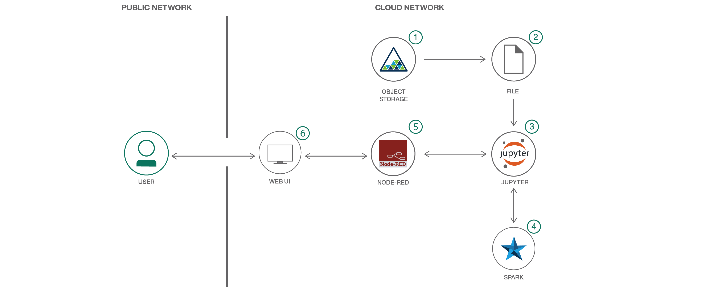
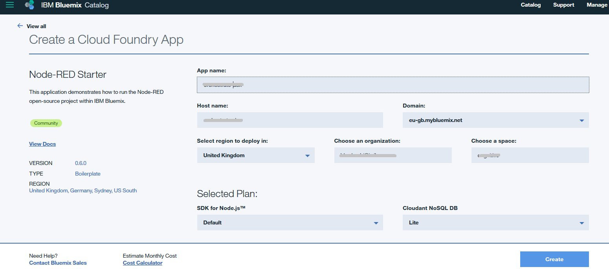
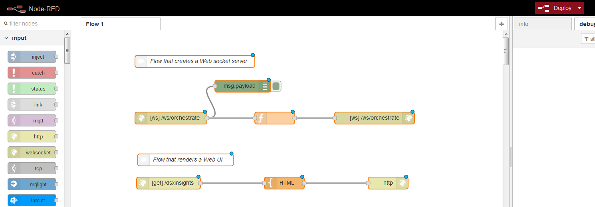
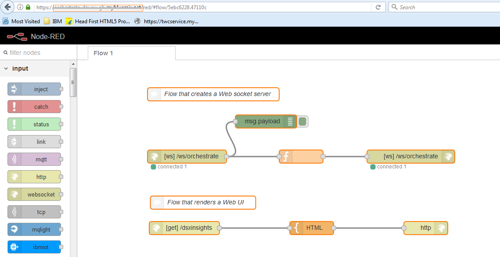
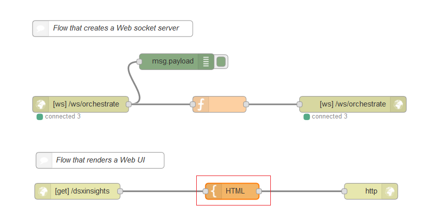
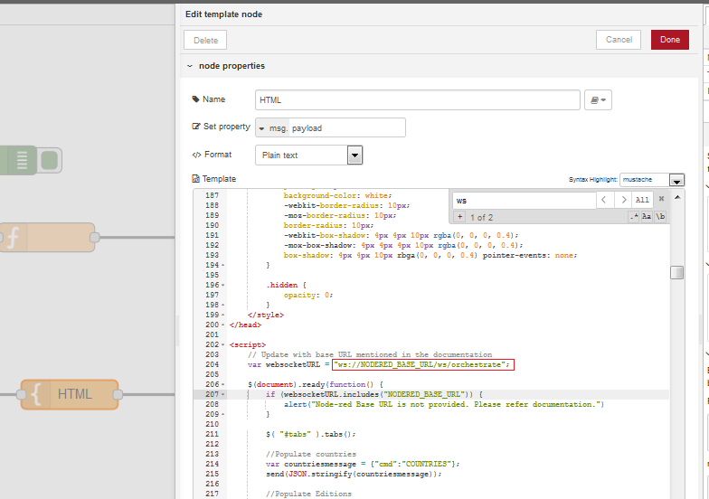
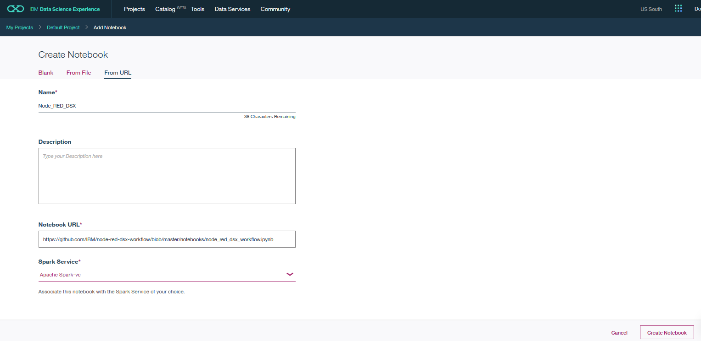
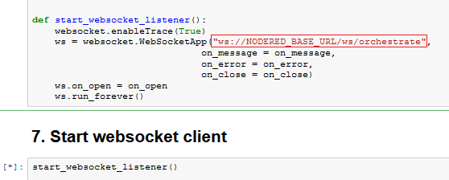
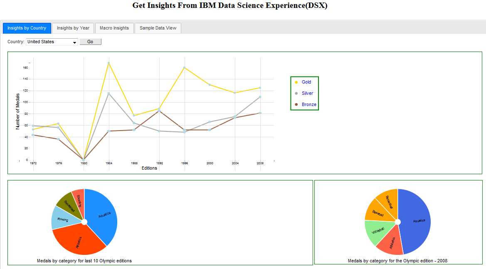

# Orchestration of the analytics workflow in IBM Data Science Experience(DSX) using a custom web user-interface built with Node-RED 

In this developer journey we will use Node-RED to render custom web user-interface and invoke the analytics workflows in Jupyter notebooks on IBM Data Science experience(DSX).

Node-RED is a tool for wiring together APIs and online services on Bluemix. The APIs and online services are configured as nodes that can be wired to orchestrate a work flow. It is also a web server where the UI solution can be deployed. It has nodes that support integration with many database services, watson services and analytics services.

When the reader has completed this journey, they will understand how to:

* Create and run a Jupyter notebook in DSX.
* Use DSX Object Storage to access data files.
* Use Python Pandas to derive insights on the data.
*	Develop a custom web user interface using Node-RED. 
*	Triggering an analytics workflow on DSX from the UI using Node-RED.

The intended audience for this journey are developers who want to develop a complete analytics solution on DSX with a custom web user interface. 

## Included components

* [Node-RED](https://console.bluemix.net/catalog/starters/node-red-starter): Node-RED is a programming tool for wiring together APIs and online services.

* [IBM Data Science Experience](https://www.ibm.com/bs-en/marketplace/data-science-experience): Analyze data using RStudio, Jupyter, and Python in a configured, collaborative environment that includes IBM value-adds, such as managed Spark.

* [Bluemix Object Storage](https://console.ng.bluemix.net/catalog/services/object-storage/?cm_sp=dw-bluemix-_-code-_-devcenter): A Bluemix service that provides an unstructured cloud data store to build and deliver cost effective apps and services with high reliability and fast speed to market.

## Featured technologies

* [Jupyter Notebooks](http://jupyter.org/): An open-source web application that allows you to create and share documents that contain live code, equations, visualizations and explanatory text.

# Watch the Video

# Steps

Follow these steps to setup and run this developer journey. The steps are
described in detail below.

1. [Sign up for the Data Science Experience](#1-sign-up-for-the-data-science-experience)
1. [Create Bluemix services](#2-create-bluemix-services)
1. [Import the Node-RED flow](#3-import-the-node-red-flow)
1. [Note the websocket URL](#4-note-the-websocket-url)
1. [Update the websocket URL](#5-update-the-websocket-url)
1. [Create the notebook](#6-create-the-notebook)
1. [Add the data](#7-add-the-data)
1. [Update the notebook with service credentials](#8-update-the-notebook-with-service-credentials)
1. [Run the notebook](#9-run-the-notebook)
1. [Analyze the results](#10-analyze-the-results)

## 1. Sign up for the Data Science Experience

Sign up for IBM's [Data Science Experience](http://datascience.ibm.com/). By signing up for the Data Science Experience, two services: ``DSX-Spark`` and ``DSX-ObjectStore`` will be created in your Bluemix account.

## 2. Create Bluemix services

Create the following Bluemix service by following the link to use the Bluemix UI. Choose an appropriate name for the Node-RED application - `App name:`. Click on `Create`.

  * [**Node-RED Starter**](https://console.bluemix.net/catalog/starters/node-red-starter)
  
  
  
  * On the newly created Node-RED application page, Click on `Visit App URL` to launch the Node-RED editor once the application is in `Running` state.
  * On the `Welcome to your new Node-RED instance on IBM Bluemix` screen, Click on `Next`
  * On the `Secure your Node-RED editor` screen, enter a username and password to secure the Node-RED editor and click on `Next`
  * On the `Browse available IBM Bluemix nodes` screen, click on `Next`
  * On the `Finish the install` screen, click on Finish
  * Click on `Go to your Node-RED flow editor`  
  
## 3. Import the Node-RED flow
The flow json for Node-RED can be found under `node-red-flow` directory. 
* Download the `orchestrate_dsx_workflow.json`
* Open the file with a text editor and copy the contents to Clipboard
* On the Node-RED flow editor, click the Menu and select Import -> Clipboard and paste the contents

 
 
* Deploy the Node-RED flow by clicking on the `Deploy` button

## 4. Note the websocket URL

The websocket URL is ws://`<Node-RED base url>`/ws/orchestrate. The `Node-RED base url` is the marked portion of the URL in the above image.

## 5. Update the websocket URL in HTML code
Click on the node named `HTML`.

Click on the HTML area and search for `ws:` to locate the line where the websocket URL is specified. 
Enter the websocket URL that was noted in the [section 4](#4-note-the-websocket-url): 	
var socket = new  WebSocket("ws://<websocket URL>");

## 6. Create the notebook

Use the menu on the top to select `Projects` and then `Default Project`.
Click on `Add notebooks` (upper right) to create a notebook.

* Select the `From URL` tab.
* Enter a name for the notebook.
* Optionally, enter a description for the notebook.
* Enter this Notebook URL: https://github.com/IBM/node-red-dsx-workflow/blob/master/notebooks/node_red_dsx_workflow.ipynb
* Click the `Create Notebook` button.

## 7. Add the data 

#### Add the data to the notebook
Use `Find and Add Data` (look for the `10/01` icon)
and its `Files` tab. From there you can click
`browse` and add data files from your computer.

> Note: The data files in the `data` directory - `olympics.csv` and `dictionary.csv` have been downloaded from https://www.kaggle.com/the-guardian/olympic-games. Please visit the site for the terms and conditions for usage of the data.

## 8. Update the notebook with service credentials

#### Add the Object Storage credentials to the notebook
Select the cell below `2.1 Add your service credentials for Object Storage` section in the notebook to update
the credentials for Object Store. 

Use `Find and Add Data` (look for the `10/01` icon) and its `Files` tab. You should see the file names uploaded earlier. Make sure your active cell is the empty one created earlier. Select `Insert to code` (below your file name). Click `Insert Crendentials` from drop down menu.

#### Update the websocket URL in the notebook
In the `6. Expose integration point with a websocket client` cell, update the websocket url noted in [section 4](#4-note-the-websocket-url) in the `start_websocket_listener` function.

## 9. Run the notebook

When a notebook is executed, what is actually happening is that each code cell in
the notebook is executed, in order, from top to bottom.

Each code cell is selectable and is preceded by a tag in the left margin. The tag
format is `In [x]:`. Depending on the state of the notebook, the `x` can be:

* A blank, this indicates that the cell has never been executed.
* A number, this number represents the relative order this code step was executed.
* A `*`, this indicates that the cell is currently executing.

There are several ways to execute the code cells in your notebook:

* One cell at a time.
  * Select the cell, and then press the `Play` button in the toolbar.
* Batch mode, in sequential order.
  * From the `Cell` menu bar, there are several options available. For example, you
    can `Run All` cells in your notebook, or you can `Run All Below`, that will
    start executing from the first cell under the currently selected cell, and then
    continue executing all cells that follow.
* At a scheduled time.
  * Press the `Schedule` button located in the top right section of your notebook
    panel. Here you can schedule your notebook to be executed once at some future
    time, or repeatedly at your specified interval.

## 10. Analyze the results

Access the UI at the URL: http://`<Node-RED base url>`/dsxinsights. 
The `<Node-RED base url>` is the URL noted in section [Note the websocket URL](#4-note-the-websocket-url).

# Troubleshooting

[See DEBUGGING.md.](DEBUGGING.md)

# License

[Apache 2.0](LICENSE)

